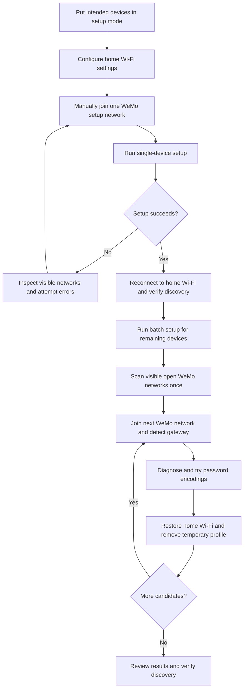

# Set Up WeMo Wi-Fi on Windows

Use these scripts to connect WeMo devices to your home Wi-Fi without the Belkin
app. Test one device first, then let the batch script configure the remaining
devices. Internet is only needed to install Python and dependencies beforehand.

## Before You Start

- Use Windows with English `netsh` output and one connected Wi-Fi adapter.
- Your home network must offer 2.4 GHz Wi-Fi with WPA2/AES security.
- Windows must allow Wi-Fi scanning and connection changes. Enable location
  access if Windows requests it.
- Start on your home Wi-Fi and save its Windows connection profile.
- Keep this guide open: joining a device's setup network disconnects internet.

These are scripts in this checkout, not an installed `pywemo` console command.
Open PowerShell and go to the repository folder. Replace the path if necessary:

```powershell
cd C:\workspace\pywemo
```

If `.venv\Scripts\python.exe` is not already available, install Python 3.13,
then create the environment and install this checkout while internet is available:

```powershell
py -3.13 -m venv .venv
.\.venv\Scripts\python.exe -m pip install -e .
```

Run the commands below in PowerShell, not at Python's `>>>` prompt. Press Enter
after each command. If you are in Python, enter `exit()` first.

## How It Works



The scripts call the existing library's `device.setup()` and `device.reset()`;
they do not implement a second provisioning protocol. The batch script reuses
the single-device workflow and adds Windows Wi-Fi connection management.

## 1. Put Devices in Setup Mode

Power the devices on. If they are not already broadcasting setup Wi-Fi, use the
physical reset procedure for each model. Button locations and hold times vary;
use that model's instructions rather than a universal reset sequence.

Open Windows Wi-Fi settings and confirm each intended device appears as an open
network such as `WeMo.Light.710` or `WeMo.Switch.123`. The suffix is different for
each device; neither script depends on a particular suffix or fixed IP address.

A factory reset erases names, rules and Wi-Fi credentials. Changing only the
router's IP range normally does not require a reset if Wi-Fi credentials stayed
the same. Devices already in setup mode do not need another reset.

## 2. Configure Your Home Wi-Fi

Create the local settings file once:

```powershell
Copy-Item wemo-setup.example.json wemo-setup.json
notepad wemo-setup.json
```

Do not repeat the copy command after editing: it overwrites your settings.
Set `ssid` to the exact home network name, including capitalization. For example:

```json
{
  "ssid": "Forest",
  "password": ""
}
```

Leave the password empty for a hidden prompt, or save it in the file. JSON
passwords containing double quotes or backslashes must escape them as `\"` or
`\\`; the hidden prompt avoids that requirement. Saved passwords are plaintext.
`wemo-setup.json` is excluded from Git; do not share or commit it.

## 3. Test One Device

Manually connect Windows to one intended `WeMo.*` setup network. Stay connected
when Windows reports no internet. Then run:

```powershell
.\.venv\Scripts\python.exe scripts\setup_wifi.py
```

The script identifies the connected device, detects its gateway, and lists the
networks that the device can see. It checks for your configured home SSID before
attempting setup. The config specifies the target; it cannot make a network
visible to the device.

Each attempt prints its encryption method and whether password lengths are
appended. If automatic encoding fails, the script tries the other combinations.
An explicit encoding override selects only that combination.

Successful output includes:

```text
Setup result: ('1', 'success')
```

Reconnect Windows to your home network and verify the device appears:

```powershell
.\.venv\Scripts\python.exe -c "import pywemo; print([(d.name, d.host) for d in pywemo.discover_devices()])"
```

If discovery is initially empty, wait about 30 seconds and rerun it. Setup success
is the device's reported result; discovery separately checks home-network access.

## 4. Set Up the Remaining Devices

Start connected to the configured home network with its saved Windows profile.
Preview the candidates:

```powershell
.\.venv\Scripts\python.exe scripts\setup_all_wifi.py --list
```

Only proceed where all listed WeMo devices are ones you intend to configure:

```powershell
.\.venv\Scripts\python.exe scripts\setup_all_wifi.py
```

The batch requests the password once if absent from the config. It connects to
each visible open setup network, runs the same diagnostics and encoding fallback,
and restores home Wi-Fi between devices. Temporary setup profiles are removed.
It does not factory-reset devices.

Review the final per-network results and rerun the discovery command from step 3.
The batch scans once; devices absent from that scan require another run. A failed
or uncertain result is not proof the device remained disconnected: check home
discovery before trying it again.

## Troubleshooting and Optional Commands

Run diagnostics while connected to the device's setup Wi-Fi without changing its
settings:

```powershell
.\.venv\Scripts\python.exe scripts\setup_wifi.py --diagnose
```

| Output or problem | Next action |
| --- | --- |
| Home SSID missing from the scan | Check its exact name, 2.4 GHz signal and whether it is hidden. Retry the scan. |
| HTTP 500 during setup | Review the logged failing request and encoding. Automatic fallback may resolve firmware encoding differences. |
| Setup endpoint disappears | Outcome is uncertain. Reconnect to home Wi-Fi and run discovery before retrying. |
| No batch candidates | Check devices are powered, in setup mode, in range, and Windows permits Wi-Fi scanning. |
| Connection restoration fails | Reconnect to home Wi-Fi manually and inspect the printed batch results. |

The generic network recommendations remain in the
[README troubleshooting section](../README.rst#setup-troubleshooting).

### HTTPNotOkException: Received status 500 for WiFiSetup1

Observed log excerpts (the device name, address and port vary):

```text
HTTPNotOkException('Received status 500 for http://10.22.22.1:49152/upnp/control/WiFiSetup1')
Error communicating with Her Office light after 3 attempts. Giving up.
SetupException: pywemo lost device <WeMo LightSwitchLongPress "Her Office light"> and was unable to reconnect. Setup status is uncertain, re-probing and checking is required.
ActionException: Error communicating with Her Office light after 3 attempts. Giving up.
```

The device's Wi-Fi setup service rejected a request. HTTP 500 alone does not
identify the cause or prove that the device disconnected. In our LightSwitch
run, the setup endpoint remained reachable and Forest was visible with
`WPA2PSK/AES`. Method 1 with appended password lengths failed; **method 3 with
appended password lengths reported success**:

```text
Attempt 3/6: SSID=Forest; encrypt_method=3; password_lengths=True
Setup result: ('1', 'success')
```

Run normal setup to use automatic fallback, or select the observed working pair:

```powershell
.\.venv\Scripts\python.exe scripts\setup_wifi.py --encrypt-method 3 --password-lengths yes
```

This is a confirmed workaround for that device/firmware, not a universal fix.
If the endpoint disappears, reconnect to home Wi-Fi and verify discovery before
retrying. The script does not parse a detailed SOAP fault from this HTTP 500,
so the underlying device error was not established.

### APNotFound: AP with SSID Forest not found

Observed messages:

```text
Error: WeMo cannot see Forest. Check 2.4 GHz coverage and SSID.
APNotFound: AP with SSID Forest not found. Try again.
```

The configured SSID was absent from that scan's parsed results. Run `--diagnose`
to print the networks the device reports. Verify the exact SSID, 2.4 GHz signal
and broadcast settings. The config cannot make the device see a network.

In our runs, a subsequent scan found Forest on channels 6 and 11 with
`WPA2PSK/AES`. The diagnostic parser was also changed to avoid dropping the first
scan line; we did not establish whether that change or a refreshed scan resolved
the initial missing-network message. A later method-2 attempt also encountered
`APNotFound`, while the following method-3 scan found Forest and succeeded.
That means method 2's encryption was not actually tested in that attempt.

### ReadTimeoutError: Read timed out during Wi-Fi setup

Observed warning excerpt:

```text
Retrying ... after connection broken by 'ReadTimeoutError("HTTPConnectionPool(host='10.22.22.1', port=49152): Read timed out. (read timeout=3.0)")': /upnp/control/WiFiSetup1
```

An individual request timed out; wait for the final setup result. In our second
LightSwitch run, this warning was followed by a successful connection in
8.27 seconds using method 1 with appended password lengths:

```text
Setup result: ('1', 'success')
WeMo.Light.454: setup reported success
```

Do not reset a device solely because of this warning. If no success follows,
check home-network discovery; a timeout can leave the outcome uncertain.

### Setup URL is None in manual Python setup

Earlier manual setup printed:

```text
>>> print(url)
None
```

One confirmed input mistake was `gateway = input("10.22.22.1")`: the address is
only the prompt text. Pressing Enter without entering a value assigns an empty
string. Assign the actual gateway directly, or type it at the prompt.

Another check returned no endpoint while Windows was still connected to home
Wi-Fi rather than the device's setup network. Check the connection first.
The scripts now validate the setup SSID and detect its gateway automatically.
`None` by itself does not distinguish a wrong address from an unreachable device.

### Older device addresses time out after a subnet change

An earlier connectivity check returned `unreachable: timed out` for the old
`192.168.0.x` addresses while Windows was on `192.168.1.x`. After changing router
address ranges, use discovery to locate current addresses instead of reusing
the old ones. If a device is already reset, provision it through its setup Wi-Fi.
A changed IP range alone does not require factory reset.

### Optional Commands

Override a gateway only when automatic detection fails, using the actual setup
network gateway shown by `ipconfig`:

```powershell
.\.venv\Scripts\python.exe scripts\setup_wifi.py --ip 10.22.22.1
```

Select one encoding explicitly:

```powershell
.\.venv\Scripts\python.exe scripts\setup_wifi.py --encrypt-method 3 --password-lengths yes
```

If a device is reachable on its setup network and needs a factory reset:

```powershell
.\.venv\Scripts\python.exe scripts\setup_wifi.py --factory-reset
```

Check the printed device identity before typing `RESET`. This erases the name,
rules and Wi-Fi settings. Wait for reboot and reconnect to its setup network.
Some models do not support software reset; use their physical reset procedure.
